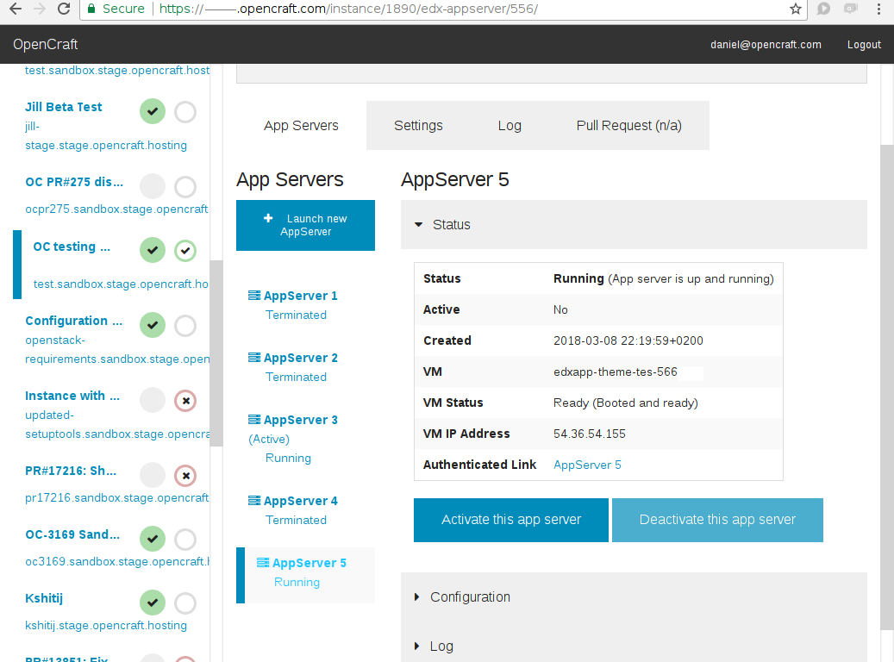

OpenCraft Instance Manager
==========================

 

The OpenCraft Instance Manager (Ocim) is a Django application to deploy and
manage [Open edX](https://open.edx.org/) sandboxes on
[OpenStack](https://www.openstack.org/) virtual machines. It is primarily
intended for testing new features, and can deploy sandboxes automatically from
GitHub pull requests.

It also includes a web console where you can create new servers and check their status and configuration.

Documentation
-------------

The documentation for OpenCraft Instance Manager is located at <https://ocim.opencraft.com>.
