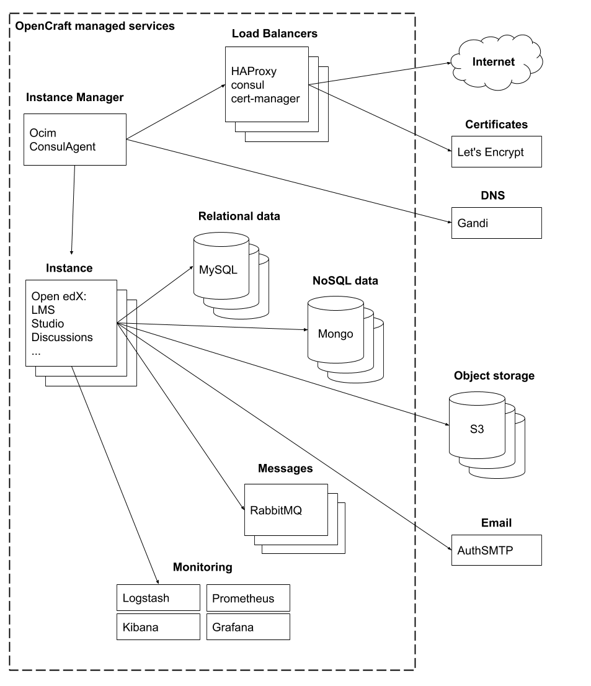

## Infrastructure

OpenCraft uses a number of open source services to support the Open edX instances managed by Ocim.

Note that there are many different ways to deploy and use Ocim.  This diagram illustrates OpenCraft's scalable,
high-availability approach.

See the [open-craft:ansible-playbooks] repository for deployment scripts for the OpenCraft-managed resources.

### Open edX

OpenCraft uses [OVH] to host the Open edX virtual machines (VMs).  Each Ocim instance may have one or more active VMs,
depending on user load and performance requirements.

These VMs deployed by Ocim are disposable -- all data is persisted to separate hosted databases and object storage, so
that the Open edX VMs themselves can be redeployed with updated code or altered configuration without disrupting the
user experience or losing data.

### Course and User Data

Course and user data are stored on high-availability, multi-server database clusters ([MySQL] and [MongoDB]).  While the
server infrastructure is shared between Ocim instances, each is given its own databases and [RabbitMQ] process queue for
data isolation and security.

Ocim creates an AWS [S3] bucket for each Ocim instance to store object data: profile images, learner uploaded files,
tracking logs, etc.

### Caching and search

By default, each Open edX VM also runs [Memcached] and [Elasticsearch] to handle user session caching and to index
course and discussion data.  For best performance, OpenCraft recommends that each Ocim instance use a separate VM to
host memcached and elasticsearch.

### Load balancing, monitoring, and configuration management

[HAProxy] provides the interface between the Open edX VMs and the internet.  OpenCraft maintains a high-availability,
multi-server HAProxy cluster to route and load balance requests to the backend servers.

Ocim uses [Consul] to coordinate between the Ocim instances and the load balancer, monitoring, and certificate
management services.

OpenCraft uses [Prometheus] and [Grafana] to monitor the deployed Ocim instances and their supporting services.  Service
logs are rotated using [Logstash], and queried using [Kibana].

### Domains, certificates, and email

Ocim instances are created as subdomains under `opencraft.hosting` with DNS hosted by [Gandi]. SSL certificates are
created and updated monthly using the [Let's Encrypt] certificate management service.  Clients may also choose to
provide their own organizational domains and certificates.

Open edX is configured to use [AuthSMTP] to send emails, but clients may also choose to use their own organization's
email service.

[AuthSMTP]: https://www.authsmtp.com/
[Consul]: https://www.consul.io/
[Elasticsearch]: https://www.elastic.co/
[Gandi]: https://www.gandi.net/
[Grafana]: https://grafana.com/
[HAProxy]: http://www.haproxy.org/
[Kibana]: https://www.elastic.co/kibana
[Let's Encrypt]: https://letsencrypt.org/
[Logstash]: https://www.elastic.co/logstash
[Memcached]: https://memcached.org/
[MongoDB]: https://www.mongodb.com/
[MySQL]: https://www.mysql.com/
[open-craft:ansible-playbooks]: https://github.com/open-craft/ansible-playbooks
[OVH]: https://www.ovhcloud.com/
[Prometheus]: https://prometheus.io/
[RabbitMQ]: https://www.rabbitmq.com/
[S3]: https://aws.amazon.com/s3/
