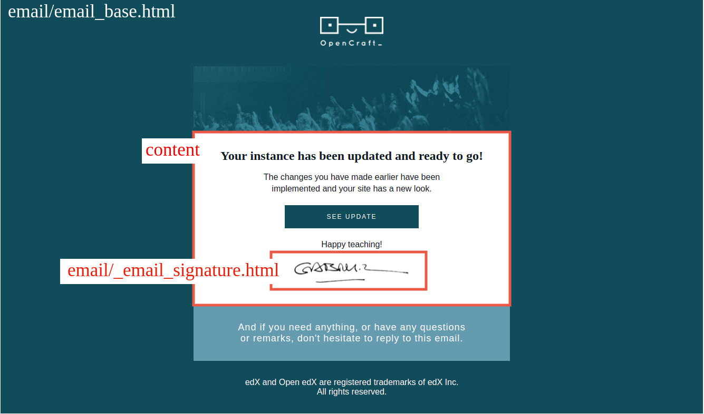
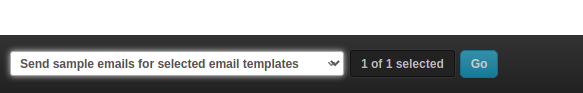

Using the Marketing app
-----------------------

Email Marketing App/functionality allows sending bulk followup emails to `Subscribers` after a predefined number of days from their instance activation. The app allows scheduling and personalizing the emails using django templates. Some of the usage examples include:

1. Sending email to all users on the 25th day of their trial to remind them of the trial ending.
2. Sending emails to users on the 10th day of their trial explaining additional features and services offered by Opencraft.
3. Sending a feedback form after their end of trial.

## Configuration Settings

`marketing` app uses following django settings for configuration:

1. `MARKETING_DELETE_FOLLOWUP_EMAILS_AFTER_DAYS`: An `int` value for the number of days after which a sent email record will be deleted from the database. Defaults to `30`.
2. `MARKETING_EMAIL_SENDER`: The sender email address for marketing emails.
3. `MARKETING_EMAIL_REPORT_RECIPIENTS`: A list of email addresses who will recieve the report email.

## Email Templates

### Creating a new followup email template

To create a new followup email template:

1. Visit page `/admin/marketing/emailtemplate/add/` on the OCIM admin.
2. Fill in the required fields (`name`, `subject`, `html_body`, `plaintext_body` and `send_after_days`). 
3. The fields `subject`, `plaintext_body` and `html_body` support complete django templating (explained below).
4. Keep the is_active field unchecked and make it active after testing the template (explained below)
5. Click on the `Save` button to create the new email template.

### Personalising the email template

Each template (subject, plaintext_body and html_body) are provided with some user information variables which can be used in the template to provide a personalized followup email.

#### Basic template variable usage

Following are the variables available in the templates:

1. `full_name`: The full name of P&T or trial user stored in the profile model
2. username
3. `subdomain`: The instance subdomain associated with the application instance.
4. `instance_name`: The instance_name associated with the application instance.
5. `application`: This is an instance of the BetaTestApplication and can be used to retrieve all other information related to the application instance.

Value of these variables can be used by wrapping them with double curly brackets ( `{{ variable_name }}` ) in the templates.
Following is a sample template using some of these variables:

```text
Welcome {{ full_name }}!

Your Open edX instance {{ instance_name }} is ready!

Thank you for signing up with OpenCraft!
We are very excited to have you onboard.

If you need anything, or have any questions or suggestions,
don’t hesitate to reply to this email.
```

#### Advanced template features

Two reusable templates defined in OCIM source can also be used in your Email Templates

1. `emails/_email_signature.html`: This template can be used to add the default signature to the emails. Add ``  in any html body where you wish to include the default signature.
2. `emails/email_base.html`: This template contains the default styling of an OpenCraft email and can be used as base for the html body of your email templates (see image below). Add ```` at the beginning of html body and include the content inside as ` <your content here> `

The following screenshot represents these special email components:



Following is a sample email template using the advanced features:

```html


    <p>Hello {{ full_name }},</p>
    <p>Click the following link to receive a fresh pizza for free every week:
      <a href="https://pizza.com">https://pizza.com</a>
    </p>

    <p>Thanks for your consideration.</p>

    <p>Best,&nbsp;</p>
    <p>Joe Pizza</p>

    

```

### Testing the email templates

Make sure to test the email templates before marking them active and actually sending them to our users. Following are the instructions to test them before activating:

1. Open email templates in admin ( admin/marketing/emailtemplate/ )
2. Select the email template to test.
3. Select `Send sample email for selected templates` from the action dropdown at the bottom of the page and hit the Go button.


You should receive an email in your inbox shortly with some dummy data populated for the application.

## Subscribers

Subscribers are a list of users who will receive the followup emails. A user not added to the Subscriber list will not receive any emails.

### Adding a Subscriber

A user is automatically added to the subscriber list when the first appserver is provisioned and made active.

To add a new subscriber manually

1. Visit /admin/marketing/subscriber/add/ on the OCIM site
2. Fill in the user details
3. Make sure to check the “Receive followup” checkbox. You can uncheck this field later to unsubscribe a user.
4. Click on Save button to save the changes.

!!! note

	1. Emails are triggered everyday at 0100 hrs UTC and a report is sent to all the email addresses set in `MARKETING_EMAIL_REPORT_RECIPIENTS` setting, containing a list of all the emails sent afterwards.
	2. Sent emails can be checked at `/admin/marketing/sentemail/` on admin website.
	3. The app does not send any emails that are already delivered to the user.
	4. `Subscriber` field `Trial started at` and `EmailTemplate` field `Send after days` are compared to determine if an email has to be sent today.
