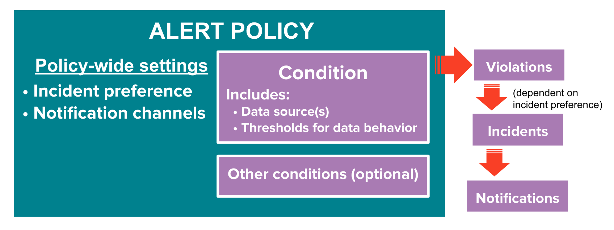

Monitoring
------------

New Relic is a SaaS tool for monitoring and alerting. Ocim supports using `New Relic Synthetics` and `New Relic Alerts` for monitoring the instances.

On Alerts, policies can be created to control the alerting behaviour. Alerts has two main components:
* **Alert Policies**: An alert policy is a group of one or more alert conditions. A policy has two settings that apply to all of its conditions: incident preference and notification channels. The incident preference is used to configure how an incident is created - per error, per condition or per policy and the notification channels are the various modes of sending out alert notifications like email, PagerDuty etc. A policy should be created before adding conditions to it.
* **Alert Conditions**: An alert condition is a combination of monitored data source, such as a Synthetics Monitor, and thresholds that define the behavior that will be considered a violation. Synthetics only reports if the pings succeeded or not, so our threshold is to check if the ping failed.

Each **Alert Policy** contains one or more **Alert Conditions**  which specify the alerting behaviour.

For example, on Open edX instances, we create a alert policy with 1 alert per policy, and add an alert condition for each service (LMS, Studio, Preview).
So if any service is down, the monitor will create an incident and trigger an alert. But if more than one service is failing on an instance, only a single incident will be created and a single alert notification will be sent due to the per-policy incident preference. This prevents the creation a large number of incidents and the resulting alert notifications when an instance goes down or there are network issues.

The image below shows the concept behind Alerts.

A more in-depth explanation of how New Relic Alerts work can be found [here](https://docs.newrelic.com/docs/alerts/new-relic-alerts/getting-started/new-relic-alerts-concepts-workflow).

## How it works on Ocim

Ocim automatically sets up monitoring for each instance, and creates all the necessary NewRelic resources for alerting. It does that by executing the `.enable_monitoring()` method on an instance after it is activated.

Additionally, the `.enable_monitoring()` and `.disable_monitoring()` methods of an instance can be called manually from the Django shell to update the New Relic resources on configuration changes or to disable monitoring.

* `.enable_monitoring()`: Sets up resources on New Relic to enable monitoring, if the resources already exist, don't change them. The resources here correspond to a URL to be monitored and a list of addresses to be notified. As long as those do not change, the existing resources will be left unmodified. If the URL is changed, the existing monitors for the old URL are not automatically removed - this is important because we don't want to delete those automatically, to avoid issues.
* `.disable_monitoring()`: Deprovisions all the New Relic resources related to that instance, including Alert Policies, Alert Conditions, Notification channels (if not shared) and Synthetics monitors. This is used when an instance is archived and might be useful for debugging.

## Deploying production instances

Ocim automatically creates an email notification channel for each email address in `settings.ADMINS` and adds them to the alert policies of all the active instances. If additional email addresses have to be alerted for the incidents related to an instance, the following manual steps will be required.

1. Using Django Admin interface, go to the OpenEdXInstance model and find the instance you want to add monitoring to.
2. Add additional monitoring emails to the `additional_monitoring_emails` field and save the model. The field takes in an array of strings with valid email addresses.
3. Apply the New Relic configuration by redeploying the instance (click on `Spawn new appserver` button on the instance page) and activating it after it is successfully provisioned.

## Troubleshooting

Most issues with Ocim monitored instances can be fixed by running `.enable_monitoring()`, but in case that's failing you can use the following checklist to help you debug the issue:

1. Check if the monitored endpoints are working as expected and available from the internet. For LMS, the monitoring address is `/heartbeat?extended`. The return of the page will point out if there's any issue with the instance.
2. Check if Ocim has valid credentials on `.env` configuration file.
3. Check if the Synthetics monitor is correctly configured and enabled.
4. Check if the monitor has a Alert Condition and Alert Policy associated.
5. Verify that there's at least 1 notification channel added to the alert policy and that the channel is receiving notifications.
